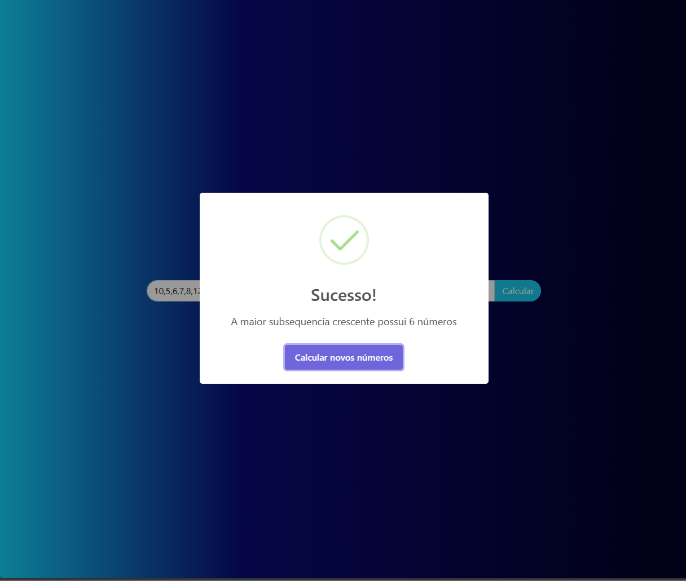
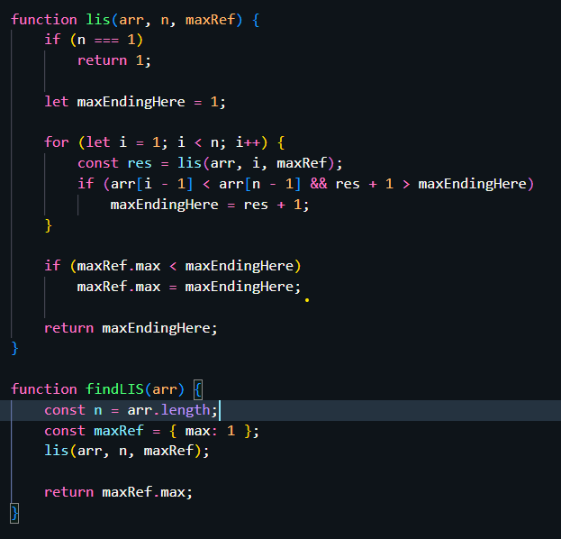

# **Contagem de Inversões**

**Número da Lista**: 1 
**Conteúdo da Disciplina**: Programação dinâmica 

## **Alunos**
|Matrícula | Aluno |
| -- | -- |
| 17/0140571  |  Douglas Farias de Castro |
| 17/0034941  |  Guilherme Peixoto |

## **Sobre**
O projeto atual faz parte de quinta entrega da disciplina de Projeto de Algoritmos. O objetivo é exercitar o algoritmo de maior subsequência crescente.

## **Screenshots**

### **SIte (Dividir)**

#### **Código**

## **Instalação**
**Linguagem**: js e C 

Para executar o projeto basta baixar e abrir o arquivo html no navegador
## **Uso**

## **Apresentação**
Foi gravado um vídeo explicando a solução de cada um dos exercícios, segue o [link](2023-11-21-00-25-04_MkCtEf2K.mp4)

OBS.: O vídeo está com a extensão .mp4 e deve ser baixado para que possa ser assistido.
